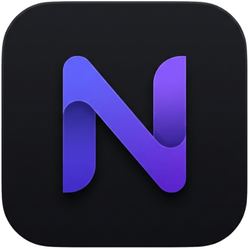
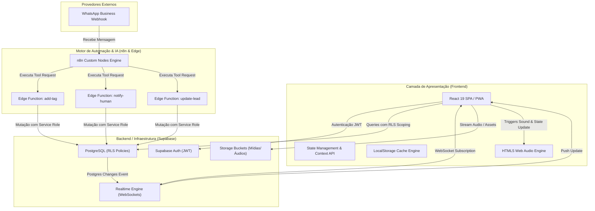

<div align="center">
  
  
  # NERO CRM & Automações n8n

  **Plataforma Enterprise de Gestão de Leads, Pipeline de Vendas e Atendimento WhatsApp com Inteligência Artificial**

  [](https://react.dev/)
  [](https://www.typescriptlang.org/)
  [](https://supabase.com/)
  [](https://n8n.io/)
  [](https://tailwindcss.com/)
  [](https://web.dev/progressive-web-apps/)

</div>

---

## Visão Geral da Arquitetura do Repositório

Este repositório armazena o ecossistema completo do **NERO CRM**, uma solução de nível corporativo projetada para concorrência de alta escala, baixa latência e desacoplamento de serviços. O ecossistema abrange a aplicação Web PWA, os Nodes comunitários customizados para o motor de IA do **n8n** e as **Edge Functions** serverless de alta performance.

### Módulos Principais:
- [`nexo-crm/`](./nexo-crm/): Aplicação Web PWA construída com React 19, TypeScript, Tailwind CSS e Supabase Realtime.
- [`n8n-nodes-nexo-crm/`](./n8n-nodes-nexo-crm/): Pacote de Nodes customizados para integração nativa do n8n AI Agent com o CRM.
- [`supabase/`](./supabase/): Edge Functions serverless (Deno/TypeScript) executadas em borda.
- [`tools.md`](./tools.md): Especificação OpenAPI e contratos de integração REST para agentes autônomos.

---

## Diagrama de Arquitetura do Sistema



---

## Padrões de Engenharia Destacados

- **Isolamento Multi-Tenant em Nível de Banco de Dados**: Proteção de dados via PostgreSQL Row Level Security (RLS) e scoping de `tenant_id`.
- **Sincronização de Estado Reativa e Event-Driven**: Subscrição de alterações via WebSockets sem sobrecarga de polling.
- **Protocolo de Handoff IA -> Humano**: Transição transparente da IA para o operador humano com persistência do resumo executivo (`resumo_ia`).
- **Cache Resiliente & Revalidação Assíncrona**: Estratégia de hidratação local instantânea com suporte a *exponential backoff retries*.
- **Arquitetura Serverless em Borda**: Edge Functions desacopladas para qualificação e movimentação de dados via n8n.

---

## Principais Funcionalidades

- **Arquitetura Multi-Tenant**: Isolamento rigoroso por empresa e controle de acesso hierárquico (*Owner*, *Admin*, *Atendente*).
- **Dashboard de Performance**: Visualização de métricas de conversão e volume de interações utilizando a biblioteca Recharts.
- **Kanban de Oportunidades**: Pipeline drag-and-drop personalizável com contadores em tempo real.
- **WhatsApp Chat Omnichannel**: Atendimento em tempo real com histórico persistido e suporte a mensagens de áudio e mídias.
- **Protocolo Handoff Humano**: Transferência transparente da IA para o operador humano com resumo executivo da conversa (`resumo_ia`).
- **Player de Áudio Avançado**: Controle de velocidade de reprodução e suporte nativo para áudios codificados.
- **Etiquetas e Qualificação (Tags)**: Sistema dinâmico de criação e atribuição de tags coloridas para segmentação de leads.
- **Edge Functions Desacopladas**: Endpoints Serverless Deno para integração direta com n8n e agentes autônomos.
- **Progressive Web App (PWA)**: Aplicação instalável via Service Worker com estratégia de Runtime Caching configurada.

---

## Tecnologias Utilizadas

### **Frontend (Web App)**
- **React 19**, **TypeScript** & **Vite 6**
- **Tailwind CSS** & **Lucide React**
- **Recharts** & **Vite PWA Plugin**

### **Backend & Infraestrutura**
- **Supabase PostgreSQL** & **Supabase Auth**
- **Supabase Realtime** & **Storage**
- **Deno Edge Functions**

### **Automações**
- **n8n Community Node** (`n8n-nodes-nexo-crm`)

---

## Como Executar a Aplicação Web

1. **Acesse a pasta do CRM:**
   ```bash
   cd nexo-crm
   ```

2. **Instale as Dependências:**
   ```bash
   npm install
   ```

3. **Configure as Variáveis de Ambiente:**
   Copie o modelo `.env.example` para `.env`:
   ```bash
   cp .env.example .env
   ```
   E preencha com as credenciais do Supabase:
   ```env
   VITE_SUPABASE_URL=https://jreklrhamersmamdmjna.supabase.co
   VITE_SUPABASE_ANON_KEY=sua_chave_anonima_do_supabase_aqui
   ```

4. **Inicie o Servidor de Desenvolvimento:**
   ```bash
   npm run dev
   ```
   Acesse a aplicação localmente no navegador em `http://localhost:3000` ou acesse a versão em produção em `https://crm-nero.vercel.app`.

---

## Licença

Este projeto é de propriedade privada e desenvolvido para o **NERO CRM**. Todos os direitos reservados.

---

<div align="center">
  <p>Desenvolvido por <strong>Alan Silva</strong></p>
</div>
