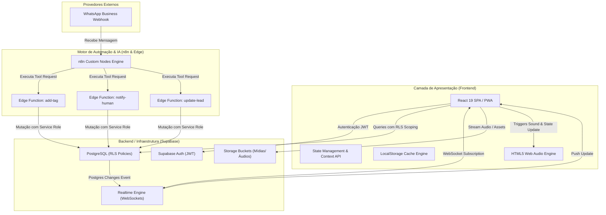

<div align="center">
  
  
  # NERO CRM
  
  **Plataforma Enterprise de Gestão de Leads, Pipeline de Vendas e Atendimento WhatsApp com Inteligência Artificial**

  [](https://react.dev/)
  [](https://www.typescriptlang.org/)
  [](https://supabase.com/)
  [](https://vitejs.dev/)
  [](https://tailwindcss.com/)
  [](https://web.dev/progressive-web-apps/)

</div>

---

## Visão Geral da Arquitetura

O **NERO CRM** é uma plataforma de gestão de relacionamento com clientes de nível corporativo, projetada sob princípios de alta concorrência, baixa latência e desacoplamento de serviços. O sistema atua como o núcleo operacional para times de vendas e atendimento, integrando agentes autônomos de IA (n8n AI Agents / WhatsApp Webhooks) e atendentes humanos em um ambiente **Multi-Tenant** isolado e altamente seguro.

A arquitetura foi projetada para resolver três desafios críticos de engenharia:
1. **Transição Transparente IA -> Humano (Handoff Protocol)**: Garantir que a IA pause instantaneamente ao detectar necessidade de atendimento humano sem perda de histórico de conversação.
2. **Sincronização de Estado Reativa**: Refletir mudanças em tempo real no pipeline Kanban e nas conversas entre múltiplos operadores sem necessidade de polling.
3. **Isolamento Estrito de Dados Multi-Tenant**: Garantir separação lógica de dados e controle hierárquico de acesso (*Owner*, *Admin*, *Atendente*) via banco relacional.

---

## Diagrama de Arquitetura do Sistema



---

## Padrões de Projeto & Decisões de Engenharia

### 1. Isolamento Multi-Tenant com RLS (Row Level Security)
A segurança de dados entre empresas é garantida no nível do banco de dados (PostgreSQL RLS) e propagada no frontend via `tenant_id` context scoping:
- Todo registro no banco carrega a chave estrangeira `tenant_id`.
- As requisições executadas pelo cliente aplicam automaticamente o filtro do Tenant resolvido na sessão JWT.
- A resolução de papéis (*Owner*, *Admin*, *Atendente*) determina permissões refinadas de visualização e edição.

### 2. Sincronização Reativa Orientada a Eventos (Supabase Realtime)
Em substituição a padrões baseados em polling contínuo, a aplicação consome um canal exclusivo do Supabase Realtime (`leads-realtime`):
- Filtro no nível de protocolo: `filter: tenant_id=eq.${effectiveUserId}`.
- O pipeline Kanban e o chat de WhatsApp reagem instantaneamente a eventos de `INSERT`, `UPDATE` e `DELETE`.
- Disparo de alertas sonoros assíncronos no navegador quando o evento carrega a flag `notifica_humano=true`.

### 3. Protocolo de Handoff IA -> Humano
Quando o agente de IA identifica a necessidade de intervenção humana (ex: solicitação explícita do cliente ou objeção complexa):
1. O agente invoca a Edge Function `notify-human` via HTTP Request.
2. A Edge Function atualiza a flag `notifica_humano = true`, grava a mensagem de transferência e persiste o `resumo_ia` no histórico do lead.
3. O estado do lead é atualizado via WebSocket, a IA é pausada automaticamente e a equipe de atendimento recebe a notificação no painel com todo o contexto prévio sintetizado.

### 4. Cache Resiliente & Hydration Não-Bloqueante
Para mitigar latências de rede e prevenir a renderização de telas em branco durante a reconexão:
- **Cache Hit Imediato**: A aplicação restaura os dados do usuário e estado operacional do `localStorage` antes da resolução da API.
- **Revalidação em Background**: Paralelamente ao cache hit, o serviço executa re-fetch com mecanismo de *exponential backoff retry* (até 5 tentativas com delays progressivos) para sincronizar estados desatualizados sem bloquear a UI.

### 5. Media Engine & Transcrição de Áudio Customizada
- Leitura e manipulação de fluxos de áudio gravados pelo WhatsApp com suporte a aceleração de velocidade (1x, 1.5x, 2x).
- Tratamento resiliente de mídias armazenadas no Supabase Storage.

---

## Principais Funcionalidades

- **Arquitetura Multi-Tenant**: Isolamento rigoroso por empresa e controle de acesso hierárquico (*Owner*, *Admin*, *Atendente*).
- **Dashboard de Performance**: Visualização de métricas de conversão e volume de interações utilizando a biblioteca Recharts.
- **Kanban de Oportunidades**: Pipeline drag-and-drop personalizável com contadores em tempo real.
- **WhatsApp Chat Omnichannel**: Atendimento em tempo real com histórico persistido e suporte a mensagens de áudio e mídias.
- **Protocolo Handoff Humano**: Transferência transparente da IA para o operador humano com resumo executivo da conversa (`resumo_ia`).
- **Player de Áudio Avançado**: Controle de velocidade de reprodução e suporte nativo para áudios codificados.
- **Etiquetas e Qualificação (Tags)**: Sistema dinâmico de criação e atribuição de tags coloridas para segmentação de leads.
- **Edge Functions Desacopladas**: Endpoints Serverless Deno para integração direta com n8n e agentes autônomos.
- **Progressive Web App (PWA)**: Aplicação instalável via Service Worker com estratégia de Runtime Caching configurada.

---

## Contratos de API & Edge Functions (n8n AI Agent)

As Edge Functions serverless fornecem a camada de integração para agentes autônomos de IA executados no n8n:

### 1. Adicionar Tag (`POST /functions/v1/add-tag`)
Associa uma etiqueta de qualificação ao lead a partir de seu número de telefone. Caso a tag não exista, ela é criada automaticamente.

**Request Body Schema:**
```json
{
  "phone": "5511999998888",
  "tag_name": "Qualificado - High Ticket",
  "tag_color": "#6366f1",
  "user_id": "uuid-do-tenant-admin"
}
```

### 2. Notificar Humano (`POST /functions/v1/notify-human`)
Aciona a transição de atendimento. Pausa o processamento automático da IA, altera o status do lead e notifica os operadores na interface Web.

**Request Body Schema:**
```json
{
  "phone": "5511999998888",
  "message": "Cliente solicitou falar com um especialista comercial",
  "resumo_ia": "O cliente possui interesse no plano corporativo e solicitou proposta personalizada.",
  "user_id": "uuid-do-tenant-admin"
}
```

### 3. Atualizar Lead (`POST /functions/v1/update-lead`)
Executa o merge parcial de dados cadastrais, atualização de status e adição de metadados personalizados no lead.

**Request Body Schema:**
```json
{
  "phone": "5511999998888",
  "user_id": "uuid-do-tenant-admin",
  "name": "Alan Silva",
  "email": "alan@empresa.com",
  "status": "Proposta Enviada",
  "description": "Cliente validou os requisitos técnicos.",
  "dados": {
    "empresa": "Nero Soluções",
    "porte": "Enterprise"
  }
}
```

> Para mais detalhes sobre chamadas cURL e testes de integração, consulte a documentação em [`tools.md`](../tools.md).

---

## Tecnologias & Engenharia de Stack

### **Frontend**
- **React 19.2**: Utilização das mais recentes APIs do React para otimização de renderização e manuseio de estado.
- **TypeScript 5.8 (Strict Mode)**: Tipagem estática rigorosa em todas as camadas da aplicação.
- **Vite 6.2**: Bundler modular de alto desempenho com Hot Module Replacement (HMR) instantâneo.
- **Tailwind CSS 3.4**: Estilização baseada em tokens utilitários com suporte nativo a temas (Dark/Light Mode).
- **Lucide React**: Biblioteca de ícones vetoriais leves.
- **Recharts 3.6**: Motor de renderização de gráficos em SVG.
- **Vite Plugin PWA & Workbox**: Service Worker para precaching de assets estáticos e cache de APIs.

### **Backend & Infraestrutura**
- **Supabase PostgreSQL**: Banco de dados relacional com políticas de Row Level Security (RLS).
- **Supabase Auth**: Gerenciamento de sessões com tokens JWT.
- **Supabase Realtime**: Engine WebSocket para transmissão de alterações no banco de dados.
- **Supabase Storage**: Object Storage para armazenamento e servir arquivos de mídia.
- **Deno Edge Functions**: Runtime TypeScript serverless executado em borda com baixa latência.

---

## Estrutura do Projeto

```text
nexo-crm/
├── assets/
│   └── screenshots/       # Diretório de capturas de tela da interface
├── components/            # Componentes React de UI (Presentation Layer)
│   ├── Auth.tsx           # Fluxo de autenticação, login e recuperação
│   ├── Broadcasts.tsx     # Módulo de gestão de disparos em massa
│   ├── Dashboard.tsx      # Painel de indicadores e gráficos
│   ├── Kanban.tsx         # Pipeline Kanban interativo com drag & drop
│   ├── LeadsList.tsx      # Tabela de leads com ordenação e filtros
│   ├── Settings.tsx       # Configurações do perfil e da organização
│   ├── Sidebar.tsx        # Navegação principal da aplicação
│   └── WhatsAppChat.tsx   # Interface de chat omnichannel e suporte a mídias
├── src/
│   └── lib/               # Camada de Serviços, Regras de Negócio e Contextos
│       ├── AuthProvider.tsx   # Gerenciamento de estado global de autenticação
│       ├── ThemeContext.tsx   # Controle e persistência de tema (Dark/Light)
│       ├── supabase.ts        # Inicialização singleton do cliente Supabase
│       ├── leadsService.ts    # Camada de abstração de dados de Leads
│       ├── tagsService.ts     # Serviços de gerenciamento de Etiquetas
│       └── tenantService.ts   # Resolução de escopo Multi-tenant e retries
├── supabase/
│   └── functions/         # Serverless Edge Functions em TypeScript/Deno
├── .env.example           # Modelo de variáveis de ambiente do projeto
├── App.tsx                # Componente orquestrador principal da aplicação
├── index.html             # Entry point HTML com metadados de otimização SEO
├── vite.config.ts         # Configurações do bundler Vite e manifesto PWA
└── package.json           # Manifesto de dependências e scripts npm
```

---

## Instalação, Ambiente e Execução

### **Pré-requisitos de Ambiente**
- **Node.js**: `v18.0.0` ou superior
- **npm**: `v9.0.0` ou superior (ou **yarn** / **pnpm**)

### **Instruções de Instalação**

1. **Clonar o Repositório:**
   ```bash
   git clone https://github.com/Alan-silva01/crm-nero.git
   cd crm-nero/nexo-crm
   ```

2. **Instalar Dependências:**
   ```bash
   npm install
   ```

3. **Configuração de Variáveis de Ambiente:**
   Crie o arquivo `.env` a partir do modelo `.env.example`:
   ```bash
   cp .env.example .env
   ```
   Defina os valores das suas credenciais do Supabase no arquivo `.env`:
   ```env
   VITE_SUPABASE_URL=https://jreklrhamersmamdmjna.supabase.co
   VITE_SUPABASE_ANON_KEY=sua_chave_anonima_do_supabase_aqui
   ```

4. **Executar em Modo de Desenvolvimento:**
   ```bash
   npm run dev
   ```
   Acesse a aplicação no navegador em `http://localhost:3000` ou acesse o ambiente de produção em `https://crm-nero.vercel.app`.

5. **Compilação para Produção:**
   ```bash
   npm run build
   ```
   Os artefatos minificados e otimizados serão gerados no diretório `dist/`.

---

## Licença

Este projeto é de propriedade privada e desenvolvido para o **NERO CRM**. Todos os direitos reservados.

---

<div align="center">
  <p>Desenvolvido por <strong>Alan Silva</strong></p>
</div>
